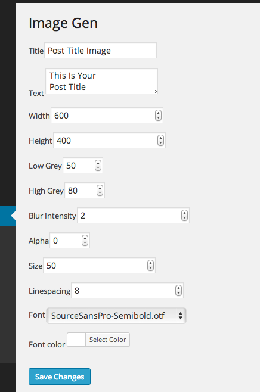

Image Gen
=========

This was created from a half-formed idea I had. As such, it doesn't have a clear use as-is, but should be extendable should I or you get around to that.

This image was actually generated:

This one too:

The currently-ugly options screen:

